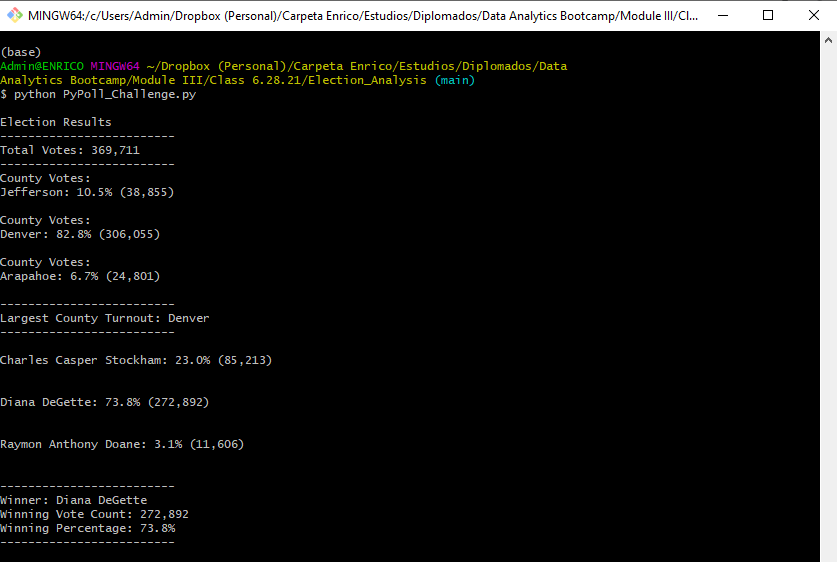

# Election_Analysis

## Overview of Election Audit

The main purpose of this analysis through Python was to provide an audit of the results to the election commission. This code includes three main breakdowns: total votes, voter turnout for each county, counter with the highest turnout, and also the same granularity by each candidate.

## Election-Audit Results

As shown in the following image there were counted 369,711 votes, most of them (82.8%) came from Denver being the largest county turnout. The winning candidate is Diana DeGette with 73.8% of all votes.

Exhibit A: Election Results.

## Election-Audit Summary

This code and analysis can be implemented in the following elections making a more efficient election process. The only request for using this script is maintaining the data framework, using the same input with the three columns Ballout ID, County, and Candidate.
